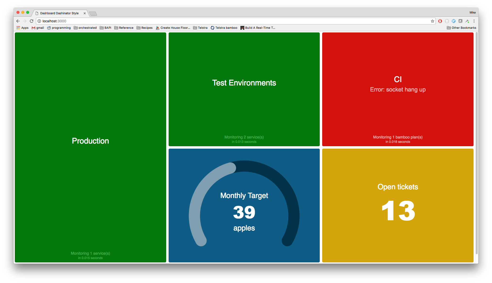

# dasher [](https://travis-ci.org/mikefarah/dasher)
Dasher the daringly delightful dashboard. A node + react + redux replacement for [dashing](https://github.com/Shopify/dashing/blob/master/README.md).

I use it to monitor a bunch of micro-services across several environments, and relevant the CI builds and deployments. Because there are so many things to monitor, I don't want to clutter the dashboard making it noisy and hard to read. Instead, the dashboard only reports on failures for Production, Test environments and the CI.



## Running

```
npm install
node server/index.js
```

Then browse to http://localhost:3000

## Configuring

Edit dashboard-config.yaml

## TODO

- Moar unit tests
- Dockerify
- Add support for various CI tools (bamboo, jenkins etc)


## Contributing

Fork, make changes, run precommit.sh then create a pull request
