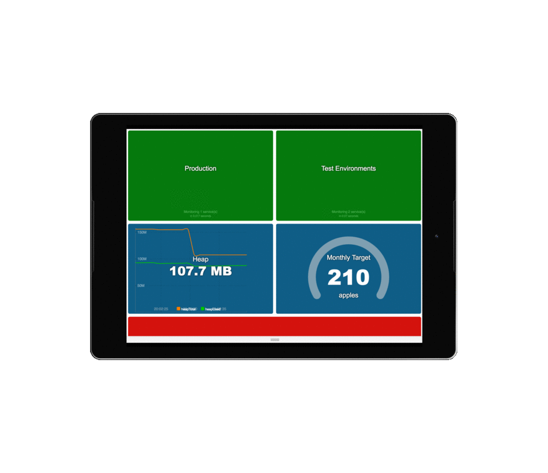

# dashinator [](https://travis-ci.org/mikefarah/dashinator)
dashinator the daringly delightful dashboard. A node + react + redux replacement for [dashing](https://github.com/Shopify/dashing/blob/master/README.md).

Use it as an information radar for teams. I use it to monitor about 30 micro-services across several environments as well as relevant the CI builds and deployments. I also use it as an information radar to show business intelligence metrics :)

Did I mention that it's responsive? Works on tablets and mobiles so you can check it (or show it off) on the go :)

Currently it supports [Bamboo](https://www.atlassian.com/software/bamboo), happy for pull requests to accept other CI tools too.



## Usage

You can use it 'out of the box' by providing a configuration. However, for more advanced customisation you will probably need to clone it and hack away.

### GIT
Clone the repo then
```sh
./server/index.js myTeamsConfig.yaml
```

### Docker

```
cat myTeamsConfig.yaml | docker run -i -p 3000:3000 mikefarah/dashinator -
```

Then browse to http://localhost:3000

## Example config YAML

```yaml
productionEnvironment:
  - name: http listener
    url: http://localhost:9999/health_check

testEnvironments:
  - name: DEV http listener
    url: http://localhost:9999/health_check
  - name: QA http listener
    url: http://localhost:9999/health_check

bamboo:
  baseUrl: https://bamboo.com
  requestOptions:
    strictSSL: false
    auth:
      user: user
      password: password
  plans:
      - AWESOME-PLAN
```

The health_check endpoints are assumed to return a successful HTTP response code if the service is healthy (successful as defined by node's request library).

dashinator will poll the services and bamboo every 20 seconds and update the dashboard accordingly.


## Ignore self signed certificates

Set the NODE_TLS_REJECT_UNAUTHORIZED environment variable to 0.

e.g:

```
cat myTeamsConfig.yaml | docker run -i -p 3000:3000 -e NODE_TLS_REJECT_UNAUTHORIZED=0 mikefarah/dashinator -
```

or

```sh
NODE_TLS_REJECT_UNAUTHORIZED=0 ./server/index.js myTeamsConfig.yaml
```


## Contributing

Fork, make changes, run precommit.sh then create a pull request
